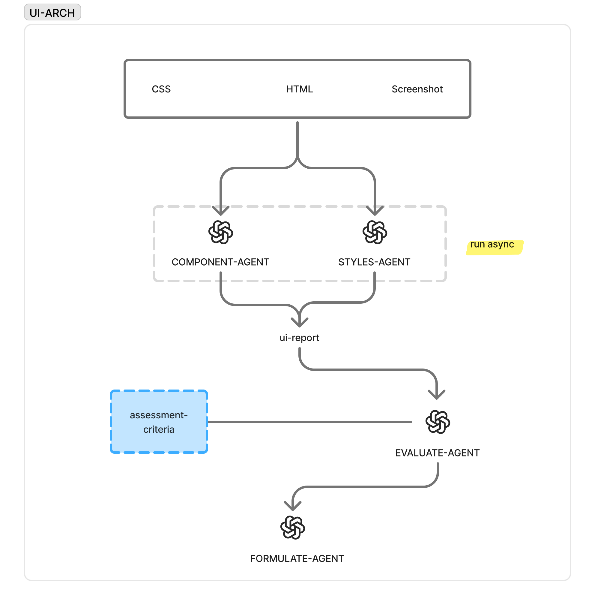
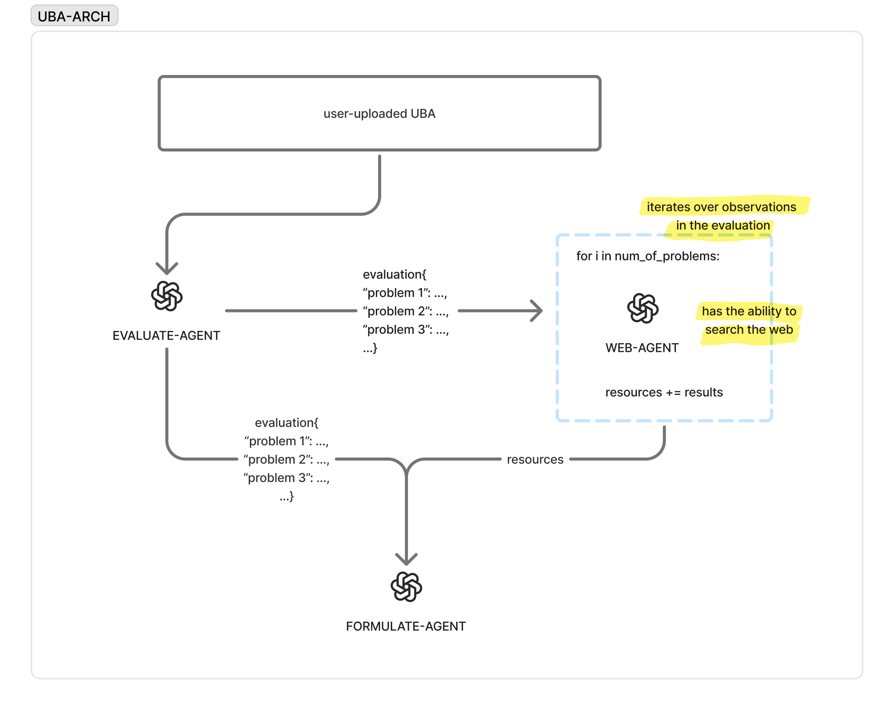

## Overview

This is the backend repository for **Proto** - a university project that serves as a proof of concept for employing agentic AI in the UX development process.

The **app's general functionality** could be described as follows: it intakes the specifications of an e-commerce web page (the landing page, search page, or product page) and uses agentic AI architecture to produce actionable recomendations to enhance the UX of that page. 

The app is built using an API-based and domain-driven approach, ensuring a modular architecture that can run independently of any frontend. This makes it easily testable using tools like Postman.

Below is a walkthrough of the app’s internal structure and instructions on how to test its endpoints.

> Note: this repo only include the backend logic to build an API server. You find the code and instructions for building the frintend in [this repo.]([this repo](https://github.com/ZahraFalih/proto-frontend))
## Domains

Inside the `Domains/` folder, you’ll find five subfolders—each representing a distinct domain. In line with Domain-Driven Design (DDD) principles, a domain encapsulates a set of related functionalities.

```
Domains/
├── Auth         # Handles user authentication
├── Onboarding   # Handles user onboarding
├── ManageData   # Handles CRUD operations for user uploads
├── Results      # Core AI logic and result generation
└── Toolkit      # Utility functions used across the app
```

Below is a breakdown of each domain and its responsibilities:

---

### Auth

Handles authentication-related operations such as login, signup, and password management.

**Endpoints:**
- `POST /auth/login/`
- `POST /auth/signup/`
- `POST /auth/logout/`
- `POST /auth/change-password/`
- ...

---

### Onboarding

Manages the user onboarding process and populates user/business/page info in the database.

**Endpoints:**
- `POST /onboarding/user-onboard/`
- `POST /onboarding/business-onboard/`
- `POST /onboarding/page-onboard/`
- `POST /onboarding/upload-screenshot/`

---

### ManageData

Enables users to manage (Create, Read, Update, Delete) their uploaded data.

**Endpoints:**
- `POST /upload/create/`
- `DELETE /upload/delete/`
- `PUT /upload/update/`
- `GET /upload/show/`
- ...

---

### Toolkit

Provides helper functionalities utilized by the AI agents, such as taking screenshots, scraping HTML/CSS, and measuring web performance.

**Endpoints:**
- `GET /toolkit/take-screenshot/`
- `GET /toolkit/business-html/`
- `GET /toolkit/business-css/`
- `GET /toolkit/web-metrics/business/`
- ...

---


## Results

The `Results` domain is the core of the application, housing the AI-powered functionalities that drive meaningful insights. It is composed of four **logical subdomains**:

- **UI Architecture (`ui-subdomain`)**
- **User Behavior Analytics Architecture (`uba-subdomain`)**
- **Web Metrics Agent (`webmetrics-subdomain`)**
- - **AI Chat (`chat-subdomain`)**

> Note that these subdomains are **behavioral**, not structural. The file organization does not reflect this split directly. Rather, they are reflected in the workflow of the agents (as will be dwmonstrated later.)

The strcuture of this domain's directiry is as follows:

```
Results/
├── LLMs/
│   ├── agents.py      # Defines the agents
│   └── prompts.py     # Stores prompts for each agent
│
└── views.py           # Wraps agents into API endpoints and orchestrate them
```

### Agent Workflow

Each agent is defined in `agents.py` and its corresponding prompt is written in `prompts.py`. After an agent is created, it's exposed through an endpoint in `views.py`. Once all agents are tested independently via Postman, they are orchestrated together into a coherent flow to fulfill the purpose of their respective subdomain. Below is a breakdown of those subdomians:

---

### UI Subdomain



This subdomain starts by invoking two agents:
- One to extract the **component structure** of the page.
- Another to **describe its visuals** operationally.

These agents take as input:
- HTML
- CSS
- Screenshot

The data is gathered by calling relevant endpoints in the Toolkit domain.

The combined output is used to build a **UI Report**, which is then evaluated by a **UI Thinking Evaluator** based on a discrete set of UX criteria. The final result is sent to a **Formulator Agent** that rewrites it into a user-friendly tone.

---

### UBA Subdomain



This subdomain evaluates user-provided UBA (User Behavior Analytics) data.

- A **Thinking Evaluator** processes the analytics.
- The result is passed through two parallel pipelines:
  1. To a **Formulator Agent** for normalization and tone adjustment.
  2. To a **Web-Search Agent** that retrieves relevant papers, threads, and articles related to the findings.

The final output merges both results and is passed through the formulator to generate the user-facing summary.

---

### Web Metrics Subdomain

This subdomain operates with a single agent:

- It fetches **web performance metrics** (like LCP, CLS, etc.) by calling tools in the Toolkit domain.
- The agent evaluates those metrics to produce a concise report for the business.

---

### AI Chat Subdomain

This subdomain provides the user with an AI chat that guides them through the results of teh previous subdomain. Therefore, the results of all previous subdomains is dumped through in the prompt of the agent of teh chat.

---

## Running the App Locally

To run this backend app on your local machine, follow the steps below:

### 1. Clone the Repository

```bash
git clone https://github.com/hussein-hh/proto-api.git
cd proto-backend
```

### 2. Create and Activate a Virtual Environment

```bash
python -m venv venv
source venv/bin/activate  # On Windows, use: venv\Scripts\activate
```

### 3. Install Dependencies

```bash
pip install -r requirements.txt
```

### 4. Set Environment Variables

Create a `.env` file in the root directory and populate it with required keys, which can be found at env.example


### 5. Run Migrations

```bash
python manage.py migrate
```

### 6. Start the Development Server

```bash
python manage.py runserver
```

### 7. Test Endpoints

Use Postman or any API client to hit the endpoints listed in the **Domains** section.


